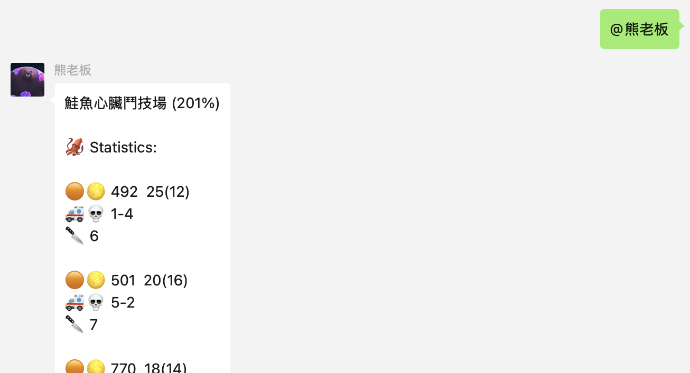

# Splatoon WeChat Bot

English | [中文](./README_zh.md)

Wechat bot for querying Splatoon 3 work (Salmon Run) results.

Contributions are welcome! Feel free to open an issue or a pull request if you have any suggestions or improvements to make.



## Usage

**Install dependencies**

```bash
npm install
```

**Obtain a session token of your Nintendo Switch Online (NSO) account**

You can use [`nxapi`](https://github.com/samuelthomas2774/nxapi) to get it.

```bash
nxapi nso auth
```

**Configure the bot**

Create a `.env` file in the root directory of the project with the following content:

```env
# NSO session token
NT_SESSION_TOKEN="your_session_token_here"

# WeChat nickname of admin
# (optional).
ADMIN_WECHAT_NICKNAME="wechat_nickname_here"

# Names of groups to respond to
# (optional, by default the bot will respond to
#  all groups)
ROOM_NAMES="room_1,room_2"

# Query throttling in milliseconds
# (optional, default is 10000)
QUERY_THROTTLE=10000

# Query last work's detail command format
# Use '{@selfName}' to represent '@your_bot_nickname'
# (optional, default is '{@selfName}')
QUERY_LAST_WORK_COMMAND_FORMAT="{@selfName}"

# Query work schedule command format
# (optional, default is '{@selfName} schedule')
QUERY_SCHEDULE_COMMAND_FORMAT="{@selfName} schedule"

# Data save directory
# (optional, default is './data/work/')
DATA_SAVE_PATH="./data/work/"

# Show the username of the player in statistics
# (optional, default is false)
SHOW_PLAYER_NAME=true

# Timezone
# (optional, default is 'Asia/Shanghai')
TIMEZONE="America/New_York"

# Language
# (optional, default is account language)
LANGUAGE="zh-CN"
```

**Run the bot**

```bash
npm start
```

Alternatively, you can run the bot with Docker.

```bash
docker run -it \
    -v $(pwd)/.env:/app/.env \
    -v $(pwd)/data:/app/data \
    -v $(pwd)/credentials:/app/credentials \
    liang2kl/splatoon-bot-wechat:latest
```

You will need to scan the QR code to log in to WeChat. Your account must be real-name verified with a credit/debit card in order to login successfully.

**Use the bot**

In the designated group chats,

- send whatever you set in `QUERY_LAST_WORK_COMMAND_FORMAT` to query the latest Salmon Run results. If not set, the default command is `@your_bot_nickname`.
- send whatever you set in `QUERY_SCHEDULE_COMMAND_FORMAT` to query the upcoming Salmon Run schedule. If not set, the default command is `@your_bot_nickname schedule`.

You can stop the bot from responding to queries by sending `/splatoon stop` by the admin. You can restart the bot by sending `/splatoon start`.
